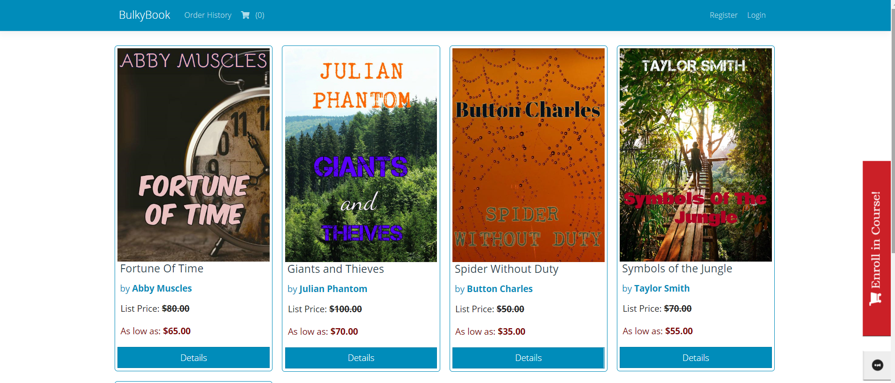

# Book Shop with ASP .NET Core MVC

## Build real world application using ASP .NET Core using EF Core, payments, repository pattern and ASP .NET Core Identity

* ASP NET MVC Core 3.1 Project
* Bootstrap v4
* Google and Facebook Authentication/Login
* SMS and Email notifications
* Stripe and Brain-tree Payment Integrations
* Dapper and Stored Procedure Calls
* View Components and Partial Views in ASP NET Core
* Authentication and Authorization in ASP NET Core 3.1
* Role Management in ASP NET Core Identity
* TempData in ASP NET Core 3.1
* Repository Pattern to Access Database
* Seed Database Migrations Automatically

## Main Page

* Seed Database Information
  * User ID  : ikerispir@gmail.com
  * Password : Ikerispir123*
  
